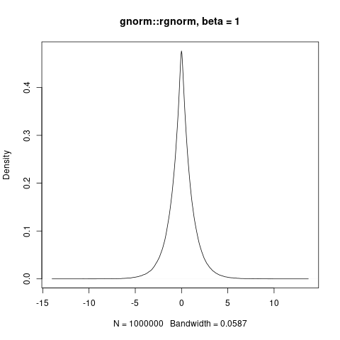
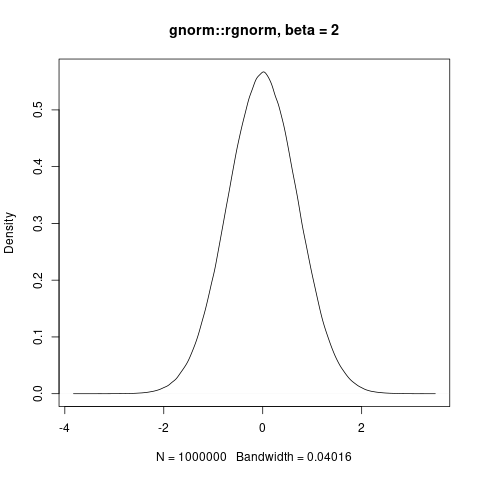
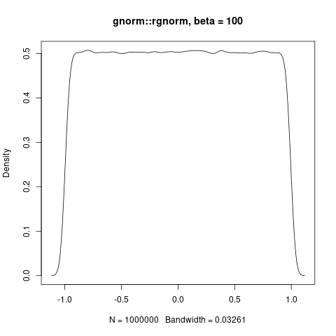
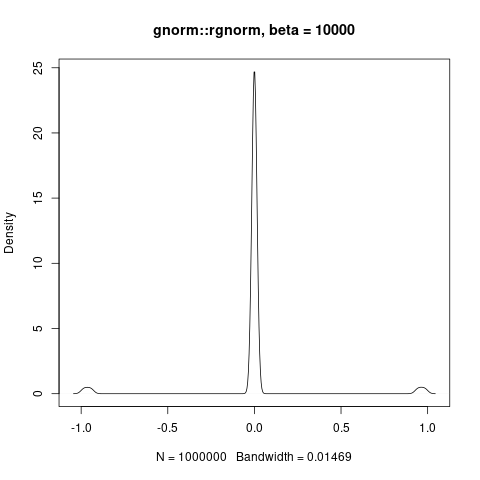
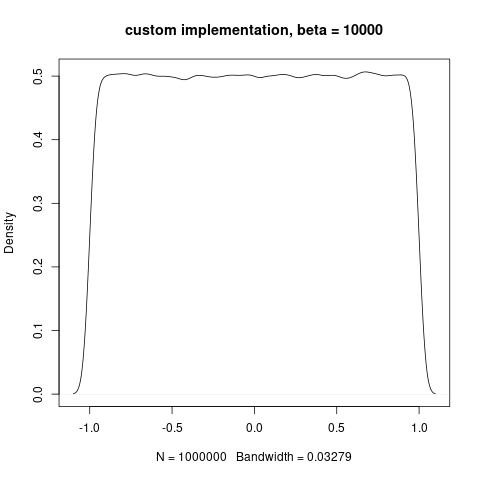

# gnorm

The generalized normal distribution is ruled by a parameter "beta" and comprises famous distributions, such as normal (beta=2) and Laplace (beta=1). The uniform distribution is also included, as beta diverges. See https://en.wikipedia.org/wiki/Generalized_normal_distribution#Version_1.

Current implementation in R is provided by package gnorm (https://cran.r-project.org/web/packages/gnorm/index.html). The random number generator (rgnorm) exploits relations with gamma distribution. This implementation is proner to break down as beta diverges.

For beta >= 1, the generalized normal distribution is log-concave, so I propose a random number generator based on Devroye's method (http://luc.devroye.org/handbooksimulation1.pdf). This alternative implementation does not break down as beta diverges. It is also provides an educational example of application for Devroye's elegant and general method.

# example

See, for beta=1, the gnorm::rgnorm function in R will give rise to Laplace-distributed samples.

And for beta=2, one gets normal-distributed samples.

As beta increases, an approximately uniform distribution is implied.

But numerically, since a beta-th square root is involved, calculations become rapidly messy, and the gnorm::rgnorm function does not do what we expect.

The same parameter configuration is handled perfectly by means of a Devroye sampling, which avoid the beta-th root method in toto.

# idea

For beta >= 1, I patch the behavior of gnorm::rgnorm with a custom implementation of Devroye's sampling. This method applies, because beta >= 1 implies that the generalized normal density is log-concave, that is, the logarithm of the density is a concave function.

What's most elegant of this method is that it an acceptance-rejection algorithm for sampling, with rejection rate not greater than 75%, for all log-concave densities.
